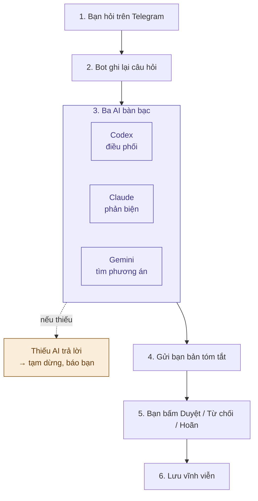

# AI Council — đọc nhanh trong 2 phút

**Một câu:** bạn hỏi trên Telegram, **3 AI của 3 hãng** bàn bạc với nhau, rồi gửi bạn
bản tóm tắt để **bạn quyết định**.

## Sơ đồ

## Ba AI bàn bạc thế nào?

**Tự nghĩ → Góp ý cho nhau → Tranh luận (tối đa 3 vòng) → Tóm tắt.**
Ý kiến phản đối luôn được giữ lại, không bị giấu.

## Dùng thế nào?

| Gõ | Để làm gì |
|---|---|
| `/council câu hỏi` | Hỏi hội đồng |
| `/council_critical câu hỏi` | Câu quan trọng: cả 3 AI phải trả lời |
| `/status` | Xem các cuộc họp đang mở |
| `/help` | Xem hướng dẫn |

## An toàn

- ✅ Chỉ bạn ra lệnh được.
- ✅ Không bịa kết quả: thiếu AI trả lời thì tạm dừng và báo bạn.
- ✅ Có trần chi phí mỗi lần hỏi (mặc định 5 USD).
- ✅ Quyết định đã bấm không sửa, không xóa được.

## Cần chuẩn bị (một lần)

1. Bot Telegram (tạo qua **@BotFather**).
2. Khóa API của ít nhất **2** hãng AI.
3. Máy chủ chạy 24/7 có **PostgreSQL**.
4. Điền vào file `.env`, rồi làm theo **Quick Start** trong [README](../README.md).

**Đổi sang model AI mới?** Chỉ cần sửa một dòng trong `.env`, không phải sửa code.
