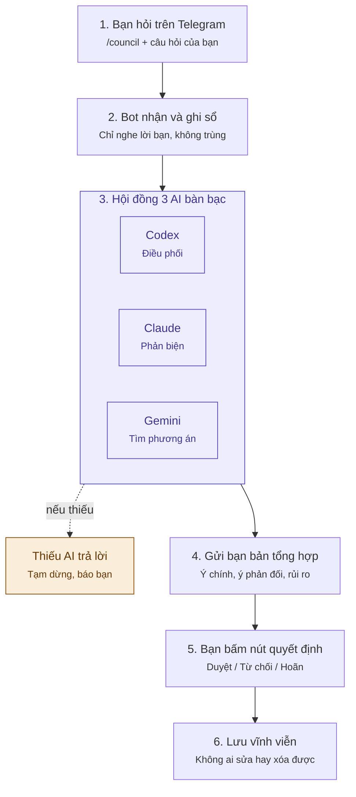

# Hướng dẫn dễ hiểu: AI Council hoạt động thế nào?

> Tài liệu dành cho người không rành kỹ thuật. Bản kỹ thuật đầy đủ ở
> [`ARCHITECTURE_v0.2.1.md`](ARCHITECTURE_v0.2.1.md).

## Ý tưởng chính

Thay vì hỏi một AI rồi tin ngay, bạn có một **"ban cố vấn" gồm 3 AI của 3 hãng khác
nhau**. Chúng tự suy nghĩ, phản biện nhau, rồi trình bạn một bản tóm tắt.
**Bạn là người quyết định cuối cùng**; các AI chỉ góp ý.

Hình dung giống một **cuộc họp công ty**: bạn là giám đốc, ba AI là ba trưởng phòng.

## Sơ đồ



## Ba "trưởng phòng" AI

| AI | Hãng | Vai trò |
|---|---|---|
| **Codex** | OpenAI | Điều phối cuộc họp, viết bản tóm tắt cuối |
| **Claude** | Anthropic | Soi lỗi, tìm điểm yếu và rủi ro |
| **Gemini** | Google | Tìm thêm phương án khác để so sánh |

Dùng ba hãng khác nhau để chúng **không cùng một "lối nghĩ"**, nhờ vậy dễ phát hiện
chỗ sai của nhau hơn.

## Cuộc họp diễn ra theo vòng

1. **Tự nghĩ:** mỗi AI trả lời riêng, không nhìn bài của nhau.
2. **Phản biện:** mỗi AI đọc ý kiến của hai AI còn lại và góp ý.
3. **Tranh luận:** nếu còn bất đồng thì tranh luận, tối đa 3 vòng. Đồng ý sớm thì
   dừng sớm.
4. **Tổng hợp:** gửi bạn kết quả. Ý kiến phản đối vẫn được giữ, không bị giấu.

## Những "luật an toàn" có sẵn

- **Chỉ bạn ra lệnh được.** Người khác nhắn vào nhóm, bot sẽ bỏ qua.
- **Không bịa kết quả.** Nếu quá ít AI trả lời (ví dụ hết tiền API), bot tạm dừng
  và báo bạn.
- **Giới hạn chi phí.** Mỗi cuộc họp có mức trần: mặc định cảnh báo ở 2 USD và dừng
  hẳn ở 5 USD (đổi được trong file `.env`).
- **Quyết định không sửa được.** Bấm nhầm hai lần thì chỉ lần đầu được tính. Muốn
  đổi ý thì tạo quyết định mới thay thế; quyết định cũ vẫn được giữ làm lịch sử.

## Cách dùng hằng ngày

Chỉ cần nhớ 3 lệnh:

| Lệnh | Tác dụng |
|---|---|
| `/council Nên chọn A hay B?` | Hỏi hội đồng |
| `/status` | Xem đang có những cuộc họp nào |
| `/help` | Xem hướng dẫn |

Câu hỏi quan trọng, muốn **cả 3 AI đều phải trả lời**: dùng `/council_critical`.

## Chuẩn bị một lần trước khi dùng

1. Tạo một bot Telegram (nhắn cho **@BotFather**) để lấy mã bot.
2. Mua khóa API của ít nhất 2 trong 3 hãng (OpenAI, Anthropic, Google).
3. Thuê một máy chủ nhỏ chạy 24/7 có cơ sở dữ liệu **PostgreSQL**. Đây là "trí nhớ"
   lưu mọi cuộc họp.
4. Chép `.env.example` thành `.env` và điền các thông tin trên.
5. Làm theo các bước trong mục **Quick Start** của [README](../README.md).

## Khi các hãng ra model AI mới

Phần lớn chỉ cần **đổi tên model trong file `.env`** rồi khởi động lại, không phải
sửa code. Ví dụ:

```
CLAUDE_MODEL_NORMAL=claude-sonnet-5-5
```

Chỉ cần sửa code khi:

- muốn báo cáo chi phí chính xác cho model mới (thêm một dòng bảng giá);
- hãng AI thay đổi cách gọi API (khi đó bot tạm dừng và báo lỗi, không bịa kết quả);
- muốn thêm AI của một hãng hoàn toàn mới.

Mẹo: khoảng 3–6 tháng một lần, kiểm tra xem model nào sắp ngừng hoạt động.
